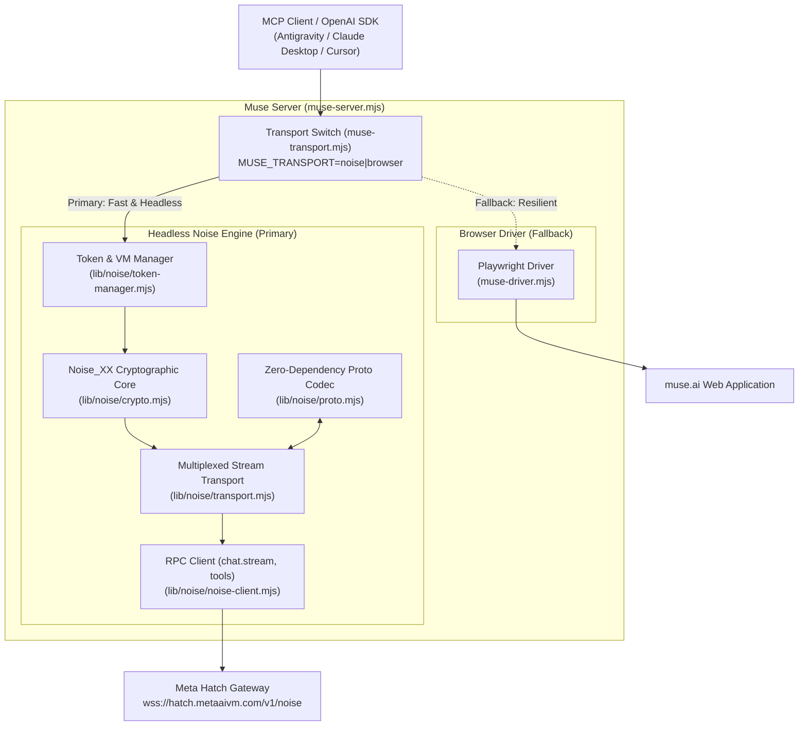

# Phase 2 Implementation Plan: Headless Noise Client & Native Tool Calling

## Overview

This document specifies the technical design, component architecture, and implementation tasks for **Phase 2** of **Muse-Chat-MCP**. 

Phase 2 replaces the heavy Playwright browser automation driver with a high-speed, headless **Noise Protocol Client** connecting directly to Meta's edge VM gateway:
`wss://hatch.metaaivm.com/v1/noise` using **`Noise_XX_25519_AESGCM_SHA256`**, with **Option A (Zero-Dependency Binary Protobuf Framing)**.

The browser automation driver is retained as an automatic fallback behind a unified transport switch (`MUSE_TRANSPORT=noise|browser`).

---

## Architecture Summary



---

## Technical Specifications

### 1. Cryptographic Handshake (`Noise_XX_25519_AESGCM_SHA256`)
* **Handshake Pattern**: `Noise_XX` (3-way mutual static key exchange).
* **DH Primitive**: `X25519` (via Node.js 20+ native `crypto.subtle`).
* **Cipher**: `AES-256-GCM` with a 96-bit nonce (`[0x00, 0x00, 0x00, 0x00, ...counter_64bit_be]`) and 128-bit authentication tag.
* **Hash**: `SHA-256`.
* **Key Derivation**: `HKDF-SHA256`.

#### Handshake Sequence
1. **Message 1 (`-> e`)**: Client generates ephemeral keypair `(e_priv, e_pub)` and sends 32-byte `e_pub`.
2. **Message 2 (`<- e, ee, s, es`)**: Server responds with its ephemeral `re`, encrypted static key `rs`, and encrypted attestation payload.
3. **Message 3 (`-> s, se`)**: Client sends its encrypted static key `s` and encrypted authentication ticket.
4. **Split**: Handshake state splits into two independent operational cipher states: `txCipher` (client to server) and `rxCipher` (server to client).

---

### 2. Zero-Dependency Protobuf & Wire Framing (Option A)

Rather than pulling in external compilation tools or bulky libraries, we implement a compact binary encoder/decoder in pure JavaScript (~130 lines) directly handling the two wire envelopes:

#### 2.1 Transport Frame (`ingress_rev_proxy.NoiseTransportFrame`)
Chunking envelope for messages over 65,489 bytes:
* **Tag 1** (`int64 chunk_id`): Varint
* **Tag 2** (`uint32 chunk_index`): Varint
* **Tag 3** (`uint32 total_chunks`): Varint
* **Tag 4** (`bytes payload`): Length-delimited

#### 2.2 Service Frame (`hatch.noise.ServiceFrame`)
Multiplexed HTTP-over-Noise envelope:
* **Tag 1** (`uint64 stream_id`): Varint
* **Tag 2** (`ApplicationRequest request`): Length-delimited
* **Tag 3** (`ApplicationResponse response`): Length-delimited
* **Tag 4** (`BodyChunk body_chunk`): Length-delimited
* **Tag 5** (`Reset reset`): Length-delimited

#### 2.3 Application Request / Response
* **`ApplicationRequest`**:
  * Tag 1: `string verb` ("POST", "GET")
  * Tag 2: `string path` (e.g., `/chat/stream`, `/client/register-capabilities`)
  * Tag 3: `repeated Header headers` (key/value pairs)
  * Tag 4: `bytes body` (JSON or binary payload)
  * Tag 5: `bool end_body`
* **`ApplicationResponse`**:
  * Tag 1: `uint32 status` (HTTP status code, e.g. 200)
  * Tag 2: `repeated Header headers`
  * Tag 3: `bytes body`
  * Tag 4: `bool end_body`

---

### 3. Session & Ticket Bootstrapping

The Noise client operates completely headlessly by recycling the persistent session cookies (`c_user`, `xs`, `datr`) stored in `.muse-profile`:

1. Read cookies from `.muse-profile/Default/Network/Cookies` (or cookie cache).
2. Wake the Hatch VM:
   ```http
   POST https://muse.ai/api/hatch/vm/wake
   Cookie: c_user=...; xs=...; datr=...
   ```
3. Retrieve VM endpoint and session details:
   ```http
   GET https://muse.ai/api/session
   ```
   Response returns `vm_id` (e.g. `7f426965-e66e-41f1-9627-3320c239f0f3`) and endpoint URL.
4. Obtain signed auth & notary tokens:
   ```http
   POST https://muse.ai/api/hatch/token
   ```
   Response returns `token` (`s0:...`) and `notary_token` (`endorsement.v1...`).
5. Open WebSocket connection:
   ```text
   wss://hatch.metaaivm.com/v1/noise?vm_id={vm_id}&auth_token={token}&notary_token={notary_token}&app_id=hatch-web&request_id={uuid}
   ```

---

### 4. Native Tool-Calling Passthrough

Meta's Hatch gateway natively supports client capability registration and tool execution:

* **Capability Registration**:
  * Method: `POST /client/register-capabilities`
  * Body: Registers tool definitions (name, description, JSON schema) with the model.
* **Stream Handling**:
  * Method: `POST /chat/stream`
  * When Muse invokes a tool, it emits a structured function call payload.
* **Result Ingestion**:
  * Method: `POST /client/invoke-result`
  * Transmits the tool output back into the conversation for Muse to continue its generation.

---

### 5. Multi-Thread & Concurrency Architecture

* **Stream Multiplexing**: A single Noise WebSocket connection handles multiple concurrent conversations using distinct `stream_id` values.
* **Thread Persistence**: Each thread in Muse corresponds to a unique thread ID (`/v1/threads/{id}`). The MCP server can direct queries to specific threads without needing to reload or navigate browser tabs.

---

## File Structure

```text
Muse-Chat-MCP/
├── docs/
│   ├── PHASE2_NOISE_PLAN.md       # This implementation plan
│   ├── NOISE_PROTOCOL_SPEC.md     # Protocol & wire framing specification
│   ├── ARCHITECTURE.md            # System architecture & transport lifecycle
│   └── muse-noise-client-ref.js   # Extracted reference client implementation
├── lib/
│   └── noise/
│       ├── crypto.mjs             # Noise_XX cipher states & handshake state
│       ├── proto.mjs              # Zero-dependency protobuf encoder/decoder (Option A)
│       ├── transport.mjs          # Chunk decoder & multiplexed HTTP-over-Noise transport
│       ├── token-manager.mjs      # Cookie extractor, VM wake, and token lifecycle
│       └── noise-client.mjs       # WebSocket manager and high-level RPC interface
├── test/
│   ├── test-noise-crypto.mjs      # Unit tests for cryptographic handshake
│   ├── test-proto-framing.mjs     # Round-trip tests for protobuf frames
│   └── test-noise-live.mjs        # End-to-end integration test against live gateway
├── muse-driver.mjs                # Fallback Playwright browser driver
├── muse-transport.mjs             # Unified transport switcher with auto-fallback
├── muse-server.mjs                # MCP server entry point
├── muse-openai-shim.mjs           # OpenAI HTTP shim with native tool-call streaming
├── login.mjs                      # Interactive login helper
├── login.bat                      # Windows launcher
└── package.json
```

---

## Implementation Roadmap

### Phase 2.1: Cryptographic Engine (`lib/noise/crypto.mjs`)
- [ ] Implement `CipherState` with AES-GCM-256 and 96-bit monotonic nonce counter.
- [ ] Implement `SymmetricState` with SHA-256 hashing and HKDF-SHA256 key expansion.
- [ ] Implement `HandshakeState` (`NoiseXXInitiator`) with 3-message exchange.
- [ ] Automated tests: Verify key exchange vectors against standard Noise test suites.

### Phase 2.2: Zero-Dependency Protobuf Framing (`lib/noise/proto.mjs`)
- [ ] Implement binary varint and tag read/write functions.
- [ ] Implement `NoiseTransportFrame` serializer and parser.
- [ ] Implement `ServiceFrame`, `ApplicationRequest`, `ApplicationResponse`, `BodyChunk`, and `Reset` codecs.
- [ ] Automated tests: Round-trip encode/decode tests ensuring exact binary fidelity.

### Phase 2.3: Multiplexer & Transport Layer (`lib/noise/transport.mjs`)
- [ ] Implement `NoiseFrameDecoder` for defragmenting chunked frames.
- [ ] Implement `NoiseTransport` stream multiplexer with monotonic `streamId`.
- [ ] Add encrypted request/response frame pipelining.

### Phase 2.4: Token Manager & RPC Client (`lib/noise/token-manager.mjs` & `lib/noise/noise-client.mjs`)
- [ ] Implement cookie extraction from `.muse-profile`.
- [ ] Implement HTTPS bootstrapping (`/api/hatch/vm/wake`, `/api/session`, `/api/hatch/token`).
- [ ] Implement WebSocket connection lifecycle with reconnection backoff and 25-second `connection.ping` heartbeat.
- [ ] Implement `chat.stream` RPC method.

### Phase 2.5: Transport Switcher & Seamless Fallback (`muse-transport.mjs`)
- [ ] Create `MuseTransport` abstraction implementing the common interface.
- [ ] Implement `MUSE_TRANSPORT=noise|browser` environment flag.
- [ ] Implement automatic circuit breaker: fallback to browser driver if Noise handshake or ticket fails.
- [ ] Update `muse-server.mjs` and `muse-openai-shim.mjs`.

### Phase 2.6: Native Tool Calling & Multi-Thread Support
- [ ] Implement `client.register_capabilities` tool envelope mapper.
- [ ] Implement tool-call delta streaming in the OpenAI shim.
- [ ] Implement `client.invoke.result` response handler.
- [ ] Implement multi-thread stream management.
