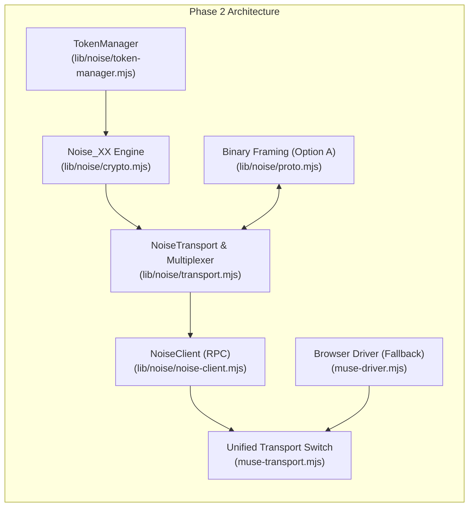

# Implementation Plan: Phase 2 — Headless Noise Client & Native Tool Calling

## Goal Description

Transform **Muse-Chat-MCP** from a pure Playwright browser-automation driver into a high-performance, hybrid client that communicates directly with Meta Muse's edge gateway over encrypted WebSockets (`wss://hatch.metaaivm.com/v1/noise`) using `Noise_XX_25519_AESGCM_SHA256`, while maintaining the existing Playwright browser driver as a graceful fallback (`MUSE_TRANSPORT=noise|browser`).

Per the user's decision, binary Protobuf and wire framing will follow **Option A (Zero-dependency native encoder/decoder)**.

This delivers:
- **~10x lower memory overhead**: Drops process footprint from ~250MB (Chrome GUI/headless) down to ~25MB (pure Node.js).
- **Sub-second response initiation**: Eliminates browser launch latency and DOM typing simulation.
- **True native tool-calling**: Leverages Meta's wire-level `client.register_capabilities` and `client.invoke.result` RPC methods.
- **Multi-thread support**: Multiplexes concurrent chats over stream IDs without browser profile lock contention.

---

## User Review Required

> [!IMPORTANT]
> **Option A (Zero-Dependency Framing)** is selected. We will implement a compact (~130 lines), high-efficiency binary encoder/decoder in pure JavaScript for:
> - `ingress_rev_proxy.NoiseTransportFrame` (Chunking & reassembly)
> - `hatch.noise.ServiceFrame` & `ApplicationRequest` / `ApplicationResponse` (Multiplexed HTTP-over-Noise)
> 
> No external npm dependencies (such as `@bufbuild/protobuf` or `protobufjs`) will be added to `package.json`.

> [!NOTE]
> **Authentication Bootstrapping**:
> The Noise client reuses the persistent cookies (`c_user`, `xs`, `datr`) saved in `.muse-profile` to authenticate the initial token wake calls (`/api/hatch/token`, `/api/session`, `/api/hatch/vm/wake`) via standard Node `fetch`. No new login is required.

---

## Open Questions

None currently. The wire schemas, protocol tags, and RPC method names have been completely reverse-engineered from the live client bundles (`3v3h8u5gphw1m.js`, `0h1y2r2my7bvv.js`) and verified against `e:\downloads\muse.ai.har`.

---

## Proposed Changes



---

### Component 1: Cryptographic Core (`lib/noise/crypto.mjs`)

Implements `Noise_XX_25519_AESGCM_SHA256` using Node 20+ native `crypto.subtle` (WebCrypto API) and `crypto.generateKeyPairSync`:

#### [NEW] `lib/noise/crypto.mjs`
- **`CipherState`**:
  - `initializeKey(keyBytes)`: Imports 32-byte AES-GCM key.
  - `encryptWithAd(ad, plaintext)` / `decryptWithAd(ad, ciphertext)`: 96-bit nonce constructed as `[0x00, 0x00, 0x00, 0x00, ...counter_64bit_be]`.
  - Nonce increment and automatic overflow guard.
- **`SymmetricState`**:
  - Hash initialization: `h = SHA256("Noise_XX_25519_AESGCM_SHA256")`, `ck = h`.
  - `mixHash(data)`: `h = SHA256(h || data)`.
  - `mixKey(inputKeyMaterial)`: HKDF-SHA256 derivation `[ck, temp_k] = HKDF(ck, ikm, 2)`.
  - `split()`: Returns `[CipherState(tx), CipherState(rx)]`.
- **`HandshakeState` (`NoiseXXInitiator`)**:
  - Implements XX initiator 3-message exchange:
    1. `writeMessage1()`: Generates client ephemeral key `e`, sends `e.publicKey` (32 bytes).
    2. `readMessage2(payload)`: Receives server ephemeral `re`, computes `DH(e, re)`, decrypts server static key `rs`, computes `DH(e, rs)`, decrypts payload (attestation/ticket).
    3. `writeMessage3(authTicket)`: Encrypts client static key `s`, computes `DH(s, re)`, encrypts `authTicket`.
  - Splits into operational bidirectional `[txCipher, rxCipher]`.

---

### Component 2: Binary Protobuf & Wire Framing — Option A (`lib/noise/proto.mjs`)

Zero-dependency binary protobuf serializer/deserializer implementing the exact proto wire formats discovered in Meta's bundle:

#### [NEW] `lib/noise/proto.mjs`
- Compact primitives:
  - `writeVarint(buf, value)` / `readVarint(buf, offset)`
  - `writeTag(buf, fieldNo, wireType)`
  - `writeBytes(buf, fieldNo, bytes)`
  - `writeString(buf, fieldNo, str)`
- Messages:
  - **`NoiseTransportFrame`**:
    - Tag 1 (`int64 chunk_id` - varint)
    - Tag 2 (`uint32 chunk_index` - varint)
    - Tag 3 (`uint32 total_chunks` - varint)
    - Tag 4 (`bytes payload` - length-delimited)
  - **`ServiceFrame`**:
    - Tag 1 (`uint64 stream_id` - varint)
    - Tag 2 (`ApplicationRequest request` - length-delimited)
    - Tag 3 (`ApplicationResponse response` - length-delimited)
    - Tag 4 (`BodyChunk body_chunk` - length-delimited)
    - Tag 5 (`Reset reset` - length-delimited)
  - **`ApplicationRequest`**:
    - Tag 1 (`verb`: string)
    - Tag 2 (`path`: string)
    - Tag 3 (`headers`: repeated key-value)
    - Tag 4 (`body`: bytes)
    - Tag 5 (`end_body`: bool)
  - **`ApplicationResponse`**:
    - Tag 1 (`status`: uint32)
    - Tag 2 (`headers`: repeated key-value)
    - Tag 3 (`body`: bytes)
    - Tag 4 (`end_body`: bool)

---

### Component 3: Framing & Multiplexer (`lib/noise/transport.mjs`)

#### [NEW] `lib/noise/transport.mjs`
- **`NoiseFrameDecoder`**:
  - Reassembles incoming chunked frames (when `total_chunks` > 1, payload chunk limit = 65,489 bytes).
  - Timeouts and purges stale chunk buffers.
- **`NoiseTransport`**:
  - Encrypts outgoing `ServiceFrame` messages with `txCipher`.
  - Decrypts incoming binary frames with `rxCipher` and decodes `ServiceFrame`.
  - Multiplexes concurrent request streams using monotonic `streamId`.

---

### Component 4: Session Bootstrapping & Token Lifecycle (`lib/noise/token-manager.mjs`)

#### [NEW] `lib/noise/token-manager.mjs`
- Reads authenticated session cookies directly from `.muse-profile` storage (or memory cache).
- Performs HTTPS lifecycle calls:
  1. `POST https://muse.ai/api/hatch/vm/wake` -> wakes the cloud container VM.
  2. `GET https://muse.ai/api/session` -> retrieves active `vm_id` and `endpoint_url`.
  3. `POST https://muse.ai/api/hatch/token` -> obtains fresh signed `auth_token` and `notary_token`.
- Manages ticket expiration (~24h) and auto-renews tokens when WebSocket drops.

---

### Component 5: Headless RPC Client & Tool-Calling Bridge (`lib/noise/noise-client.mjs`)

#### [NEW] `lib/noise/noise-client.mjs`
- Connects to WebSocket: `wss://hatch.metaaivm.com/v1/noise?vm_id=...&auth_token=...&notary_token=...`
- Executes the `NoiseXXInitiator` handshake.
- Implements RPC methods:
  - `chat.stream` (`POST /chat/stream`):
    - Sends user prompts, system instructions, and file payloads.
    - Yields streaming text chunks and SSE events.
  - `client.register_capabilities` (`POST /client/register-capabilities`):
    - Registers client tool schemas for native tool calling.
  - `client.invoke.result` (`POST /client/invoke-result`):
    - Transmits tool execution results back to the running conversation.
  - `connection.ping` (`POST /api/ping`):
    - Periodic heartbeat every 25 seconds.
  - `chat.history_window` & `chat.cancel`:
    - Session management and request cancellation.

---

### Component 6: Unified Transport Switch & Graceful Fallback (`muse-transport.mjs`)

#### [NEW] `muse-transport.mjs`
- Defines the unified `MuseTransport` abstraction:
  ```typescript
  interface MuseTransport {
    status(): Promise<MuseStatus>;
    chat(prompt: string, options: ChatOptions): Promise<ChatResult>;
    newChat(): Promise<{ ok: boolean }>;
    listChats(query?: string): Promise<ChatListResult>;
    readChat(chatTarget: string | number, max?: number): Promise<ChatHistoryResult>;
    close(): Promise<void>;
  }
  ```
- Evaluates `MUSE_TRANSPORT`:
  - `noise` (default): Attempts headless Noise connection.
  - If Noise handshake, ticket, or network fails -> immediately logs warning and routes request through `muse-driver.mjs` (Playwright fallback).
  - `browser`: Forces Playwright driver.

#### [MODIFY] `muse-server.mjs`
- Replace direct `driver` calls with `transportManager`.
- Expose transport health and active mode in `muse_status` tool:
  ```json
  {
    "transport": "noise",
    "noiseConnected": true,
    "fallbackAvailable": true
  }
  ```

#### [MODIFY] `muse-openai-shim.mjs`
- Stream native tool calls directly from `chat.stream` events into OpenAI `/v1/chat/completions` SSE stream chunks (`delta.tool_calls`).

---

## Verification Plan

### Automated Tests

1. **Cryptographic Core Unit Tests**:
   - Run synthetic Noise XX handshake vector verification:
     ```powershell
     node test/test-noise-crypto.mjs
     ```
   - Asserts: `X25519` key agreement, `AES-GCM` AD encryption/decryption, HKDF derivation consistency.

2. **Protobuf Framing Round-Trip (Option A)**:
   - Run serializer/deserializer fuzz tests against captured frames:
     ```powershell
     node test/test-proto-framing.mjs
     ```
   - Asserts: Exact bitwise reconstruction of `NoiseTransportFrame` and `ServiceFrame`.

3. **End-to-End Headless Stream Test**:
   - Connect live over `wss://hatch.metaaivm.com/v1/noise` using authenticated profile session:
     ```powershell
     node test/test-noise-live.mjs
     ```
   - Asserts: Successful handshake, stream response returned in < 1 second.

4. **Fallback Circuit-Breaker Test**:
   - Intentionally invalidate WebSocket URL/token to verify that `MUSE_TRANSPORT=noise` gracefully degrades to `browser` without throwing an error:
     ```powershell
     node test/test-fallback.mjs
     ```

### Manual Verification

1. **Verify MCP Tools in Antigravity / Claude Desktop**:
   - Call `muse_status`: confirm `"transport": "noise"` is active.
   - Send prompt via `muse_chat`: verify instant response streaming.
2. **Native Tool Calling**:
   - Ask Muse: `"What is the weather in Tokyo?"` with a mock weather tool provided in the request; verify Muse generates a structured `tool_calls` block via `client.register_capabilities`.
